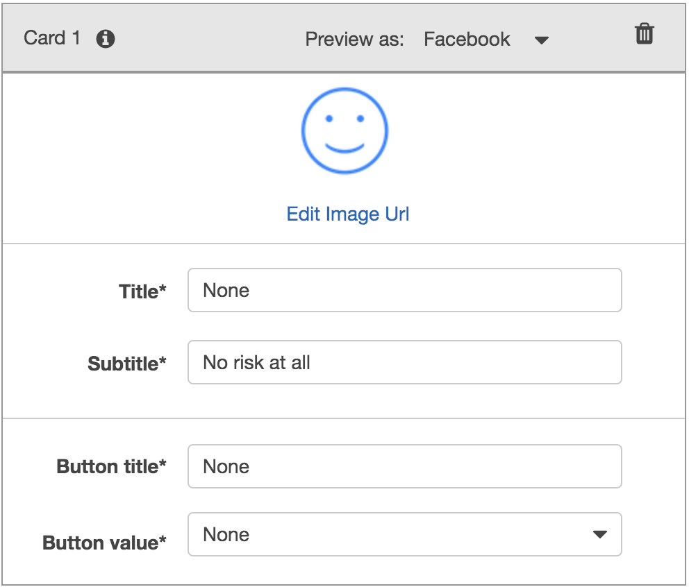
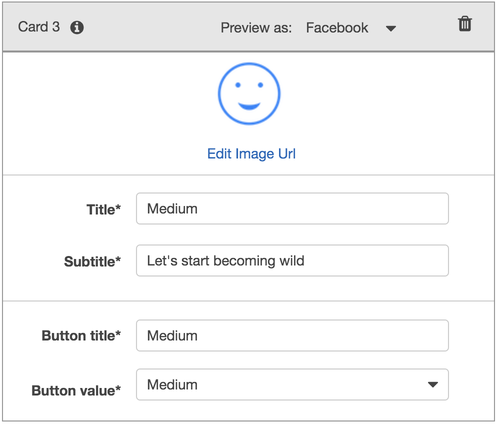
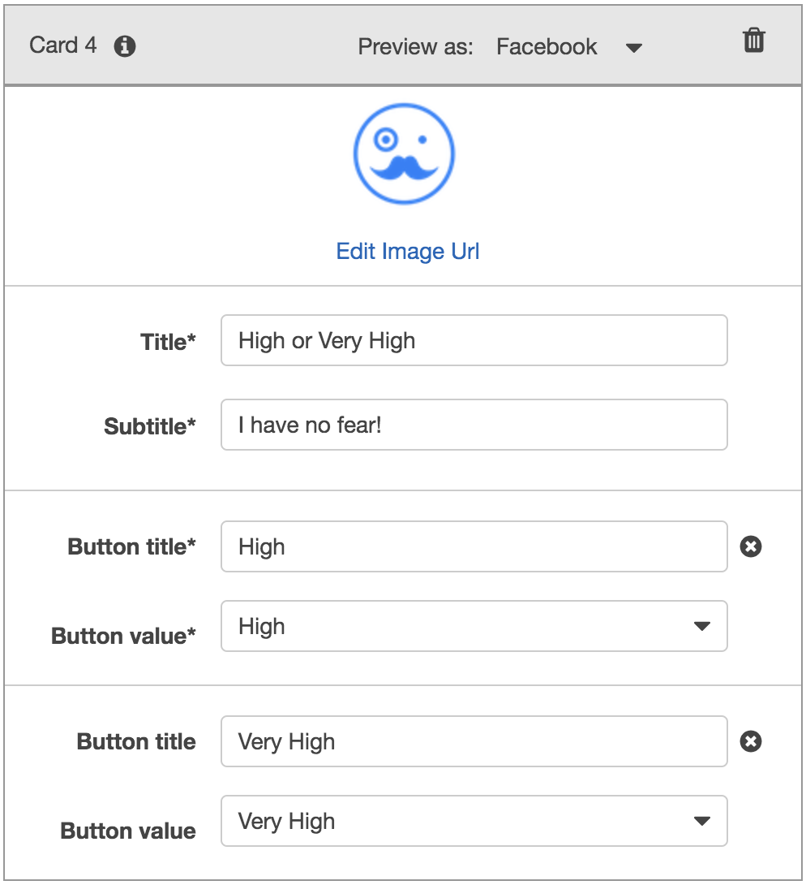

# AWS-Projects - The Power of the Cloud and Unsupervised Learning


## Project 1: Robo Advisor for Retirement Plans


*Photo by [Alex Knight](https://www.pexels.com/@alex-knight-1272316?utm_content=attributionCopyText&utm_medium=referral&utm_source=pexels) from [Pexels](https://www.pexels.com/photo/high-angle-photo-of-robot-2599244/?utm_content=attributionCopyText&utm_medium=referral&utm_source=pexels) | [Free License](https://www.pexels.com/photo-license/)*

### Background

As a digital transformation consultant of the most prominent retirement plan providers in the country; it is required to increase the client portfolio, especially by engaging young people. Since machine learning and NLP are disrupting finance to improve customer experience, it is decided to create a robo advisor that could be used by customers or potential new customers to get investment portfolio recommendations for retirement.

In this project, combine Amazon Web Services skills with Python, to create a bot that will recommend an investment portfolio for a retirement plan.

It is required to accomplish the following main tasks:

1. **[Initial Robo Advisor Configuration:](#Initial-Robo-Advisor-Configuration)** Define an Amazon Lex bot with a single intent that establishes a conversation about the requirements to suggest an investment portfolio for retirement.

2. **[Build and Test the Robo Advisor](#Build-and-Test-the-Robo-Advisor):** Made sure that the bot is working and responding accurately along with the conversation with the user, by building and testing it.

3. **[Enhance the Robo Advisor with an Amazon Lambda Function:](#Enhance-the-Robo-Advisor-with-an-Amazon-Lambda-Function)** Create an Amazon Lambda function that validates the user's input and returns the investment portfolio recommendation. This task includes testing the Amazon Lambda function and making the integration with the bot.

---

### Files

* [lambda_function.py](Starter_Files/lambda_function.py)
* [correct_dialog.txt](Test_Cases/correct_dialog.txt)
* [age_error.txt](Test_Cases/age_error.txt)
* [incorrect_amount_error.txt](Test_Cases/incorrect_amount_error.txt)
* [negative_age_error.txt](Test_Cases/negative_age_error.txt)

---

### Instructions

#### Initial Robo Advisor Configuration

First step is to create the `RoboAdvisor` bot and add an intent with its corresponding slots.

The following parameters were used:

* **Bot name:** RoboAdvisor
* **Output voice**: Salli
* **Session timeout:** 5 minutes
* **Sentiment analysis:** No
* **COPPA**: No
* **Advanced options**: No
* *Left default values for all other options.*

Created the `RecommendPortfolio` intent, and configured some sample utterances as follows (more utterances can be added as required):

* I want to save money for my retirement
* I'm ​`{age}​` and I would like to invest for my retirement
* I'm `​{age}​` and I want to invest for my retirement
* I want the best option to invest for my retirement
* I'm worried about my retirement
* I want to invest for my retirement
* I would like to invest for my retirement

The following messages were set in the *Confirmation Prompt* section:

* **Confirm:** Thanks, now I will look for the best investment portfolio for you.
* **Cancel:** I will be pleased to assist you in the future.

 This bot will utilize four slots, three using built-in types and one custom slot named `riskLevel`. The three initial slots are as follows:


| Name             | Slot Type            | Prompt                                                                    |
| ---------------- | -------------------- | ------------------------------------------------------------------------- |
| firstName        | AMAZON.US_FIRST_NAME | Thank you for trusting me to help, could you please give me your name? |
| age              | AMAZON.NUMBER        | How old are you?                                                          |
| investmentAmount | AMAZON.NUMBER        | How much do you want to invest?                                           |

The `riskLevel` custom slot will be used to retrieve the risk level the user is willing to take on the investment portfolio. The custom slot was built as follows:

* Select the `+` icon next to 'Slot Types' in the 'Editor' on the left side of the screen.
* Choose `create custom slot` from the resulting display window.
* For **Slot type name**, type: riskLevel
* Select the radial dial button next to **Restrict to Slot values and synonyms**, then fill in the appropriate values and synonums. *Example*: Low, Minimal; High, Maximum.
* Click `Add slot to intent` when finished.

To format the response cards for the intent, the gear icon next to the intent can be clicked as seen in the image below:


Next, the following data was inputted in the resulting display window:

* **Prompt:** What level of investment risk would you like to take?
* **Maximum number of retries:** 2
* **Prompt response cards:** 4

Configured the response cards for the `riskLevel` slot as shown bellow:

| Card 1                              | Card 2                              |
| ----------------------------------- | ----------------------------------- |
|   |   |

| Card 3                              | Card 4                              |
| ----------------------------------- | ----------------------------------- |
|   |   |


The error handling configuration for the `RecommendPortfolio` bot was left with the default values.


#### Build and Test the Robo Advisor

 The Robo Advisor was tested by clicking on the `Build` button in the upper right hand corner. Once the build was complete, it was tested in the chatbot window. One could see a conversation like the one below.


#### Enhance the Robo Advisor with an Amazon Lambda Function

An Amazon Lambda function was created to validate the data provided by the user on the Robo Advisor. A new lambda function was created from scratch and named `recommendPortfolio`. Selected Python 3.7 as runtime.

Completed the `recommend_portfolio()` function by following these guidelines:

##### User Input Validation

* The `age` should be greater than zero and less than 65.
* the `investment_amount` should be equals o greater than 5000.

##### Investment Portfolio Recommendation

Once the intent is fulfilled, the bot should response with an investment recommendation based on the selected risk level as follows:

* **none:** "100% bonds (AGG), 0% equities (SPY)"
* **very low:** "80% bonds (AGG), 20% equities (SPY)"
* **low:** "60% bonds (AGG), 40% equities (SPY)"
* **medium:** "40% bonds (AGG), 60% equities (SPY)"
* **high:** "20% bonds (AGG), 80% equities (SPY)"
* **very high:** "0% bonds (AGG), 100% equities (SPY)"


Once the coding was finished for the lambda function, it was tested using the [sample test cases](Test_Cases/).

After successfully testing the code, the Amazon Lex Console was opened and navigated to the `RecommendPortfolio` bot configuration, the new lambda function was integrated by selecting it on the _Lambda initialization and validation_ and _Fulfillment_ sections. Built your bot, and it had conversation as follows.


---

## Project 2: Clustering Crypto


_[Cryptocurrencies coins by Worldspectrum](https://www.pexels.com/@worldspectrum?utm_content=attributionCopyText&utm_medium=referral&utm_source=pexels) | [Free License](https://www.pexels.com/photo-license/)_

### Background

Consider, you are a Senior Manager at the Advisory Services team on a [Big Four firm](https://en.wikipedia.org/wiki/Big_Four_accounting_firms). One of your most important clients, a prominent investment bank, is interested in offering a new cryptocurrencies investment portfolio for its customers, however, they are lost in the immense universe of cryptocurrencies. They ask you to help them make sense of it all by generating a report of what cryptocurrencies are available on the trading market and how they can be grouped using classification.  

In this project, the skills in unsupervivsed learning and Amazon SageMaker skills are put into action by clustering cryptocurrencies and creating plots to present the results.

The following main tasks were accomplished:

* **[Data Preprocessing](#Data-Preprocessing):** Prepared the data for dimension reduction with PCA and clustering using K-Means.

* **[Reducing Data Dimensions Using PCA](#Reducing-Data-Dimensions-Using-PCA):** Reduced the data dimension using the `PCA` algorithm from `sklearn`.

* **[Clustering Cryptocurrencies Using K-Means](#Clustering-Cryptocurrencies-Using-K-Means):** Predicted clusters using the cryptocurrencies data using the `KMeans` algorithm from `sklearn`.

* **[Visualizing Results](#Visualizing-Results):** Created some plots and data tables to present the results.

 Deployed the notebook to Amazon SageMaker.

---

### Files

* [crypto_clustering.ipynb](Starter_Files/crypto_clustering.ipynb)

---

### Process

#### Data Preprocessing

The data was loaded into a Pandas DataFrame to continue with the following data preprocessing tasks.

1. Only the necessary columns were kept: 'CoinName','Algorithm','IsTrading','ProofType','TotalCoinsMined','TotalCoinSupply'
 
2. Only the cryptocurrencies that are trading were kept.

3. Only the cryptocurrencies with a working algorithm were kept.

4. Removed the `IsTrading` column.

5. Removed all cryptocurrencies with at least one null value.

6. Removed all cryptocurrencies that have no coins mined.

7. All rows where there are 'N/A' text values were dropped.

8. Stored the names of all cryptocurrencies in a DataFrame named `coins_name`, use the `crypto_df.index` as the index for this new DataFrame.

9. Removed the `CoinName` column.

10. Created dummy variables for all the text features, and store the resulting data in a DataFrame named `X`.

11. Used the [`StandardScaler` from `sklearn`](https://scikit-learn.org/stable/modules/generated/sklearn.preprocessing.StandardScaler.html) to standardize all the data of the `X` DataFrame. This is an important step prior to using PCA and K-Means algorithms.

#### Reducing Data Dimensions Using PCA

Used the [`PCA` algorithm from `sklearn`](https://scikit-learn.org/stable/modules/generated/sklearn.decomposition.PCA.html) to reduce the dimensions of the `X` DataFrame down to three principal components.

Once reduced the data dimensions, created a DataFrame named `pcs_df` using as columns names `"PC 1", "PC 2"` and `"PC 3"`;  used the `crypto_df.index` as the index for this new DataFrame.

The following DataFrame was created:


#### Clustering Cryptocurrencies Using K-Means

Used the [`KMeans` algorithm from `sklearn`](https://scikit-learn.org/stable/modules/generated/sklearn.cluster.KMeans.html) to cluster the cryptocurrencies using the PCA data.

Performed the following tasks:

1. Created an Elbow Curve to find the best value for `k` using the `pcs_df` DataFrame.

2. Once the best value for `k` was defined, the `Kmeans` algorithm was executed to predict the `k` clusters for the cryptocurrencies data. Used the `pcs_df` to run the `KMeans` algorithm.

3. Created a new DataFrame named `clustered_df`, that included the following columns `"Algorithm", "ProofType", "TotalCoinsMined", "TotalCoinSupply", "PC 1", "PC 2", "PC 3", "CoinName", "Class"`. The index of the `crypto_df` DataFrames was created as is shown bellow.

    

#### Visualizing Results

Some data visualizations were created to present the final results. Performed the following tasks:

1. Created a 3D-Scatter using Plotly Express to plot the clusters using the `clustered_df` DataFrame. It includes the following parameters on the plot: `hover_name="CoinName"` and `hover_data=["Algorithm"]` to show this additional info on each data point.

2. Used `hvplot.table` to create a data table with all the current tradable cryptocurrencies. The table have the following columns: `"CoinName", "Algorithm", "ProofType", "TotalCoinSupply", "TotalCoinsMined", "Class"`

3. Created a scatter plot using `hvplot.scatter`, to present the clustered data about cryptocurrencies having `x="TotalCoinsMined"` and `y="TotalCoinSupply"` to contrast the number of available coins versus the total number of mined coins. Used the `hover_cols=["CoinName"]` parameter to include the cryptocurrency name on each data point.

### AWS Sagemaker Deployment

The `hvplot` and Plotly Express libraries are not included in the built-in SageMaker environments, so for this reason the `altair` library  was used instead.

Performed the following tasks:

1. Uploaded the Jupyter notebook and renamed it as `crypto_clustering_sm.ipynb`

2. Selected the `conda_python3` environment.

3. Imported the `altair` library by running the following code before the initial imports.

  ```python
  !pip install -U altair
  ```

4. Used the `altair` scatter plot to create the Elbow Curve.

5. Used the `altair` scatter plot, instead of the 3D-Scatter from Plotly Express, to visualize the clusters. Since this is a 2D-Scatter, used `x="PC 1"` and `y="PC 2"` for the axes, and added the following columns as tool tips: `"CoinName", "Algorithm", "TotalCoinsMined", "TotalCoinSupply"`.

6. Used the `altair` scatter plot to visualize the tradable cryptocurrencies using  `x="TotalCoinsMined"` and `y="TotalCoinSupply"` for the axes.

7. Diisplayed the table of current tradable cryptocurrencies using the `display()` command.

8. Removed all `hvplot` and Plotly Express references from the code.

#### Complementary Resources

* [Altair visualization library website](https://altair-viz.github.io/).

* [Simple line chart using Altair](https://altair-viz.github.io/gallery/simple_line_chart.html).

* [Simple Scatter Plot with Tooltips using Altair](https://altair-viz.github.io/gallery/scatter_tooltips.html)

* [Color customization on Altair](https://github.com/altair-viz/altair/issues/921#issuecomment-395416682)

* [Printing all rows from a DataFrame](https://stackoverflow.com/a/30691921/4325668)

* [Install External Libraries and Kernels in Amazon SageMaker Notebook Instances](https://docs.aws.amazon.com/sagemaker/latest/dg/nbi-add-external.html)
